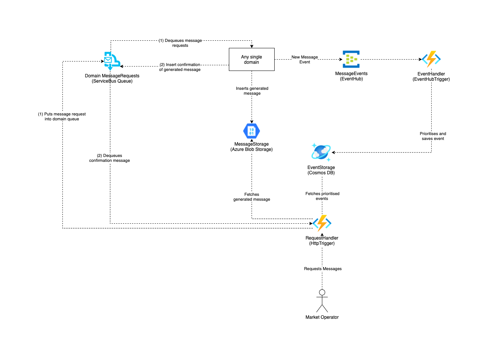

# Post Office

- [Intro](#intro)
- [Usage](#usage)
  - [Delivering messages to the post office](#a)
  - [Read and dequeue messages from the post office](#a)
- [Architecture](#architecture)

## Intro

The Post Office is the central place for handling outbound messages from within the Green Energy Hub.

This means that any domain inside the Green Energy Hub that has a message that outside actors needs to be able to read, wukk have to deliver the message to the Post Office. Read [Delivering messages to the post office](#a).

Any message delivered to the Post Office will then be processed, saved in a storage and thus made available for outside market actors to read/dequeue.

The Market Actors will be able to read and dequeue messages that they are marked as recipients of. Read [Fetching messages from the post office](#a).

## Usage

### Delivering messages to the post office

To deliver a message to the Post Office from a domain, the domain will have to insert a document into the corresponding topic of the `sbn-inbound-postoffice` service bus.

The service bus contains 3 Topics.

- aggregations
- marketdata
- timeseries

All documents inserted into each of the topics will then be processed and placed in a collection of documents, corresponding to the topic.
This means that when a domain place a document in the `timeseries` domain, this document will only be able to be peaked/dequeued using the `timeseries` type on the outbound end of the Post Office.

All documents inserted into the topics will have to comply with the protobuf contract exposed [here](source/Contracts/v1/Document.proto)

### Read and dequeue messages from the post office

TO BE DONE

## Architecture

